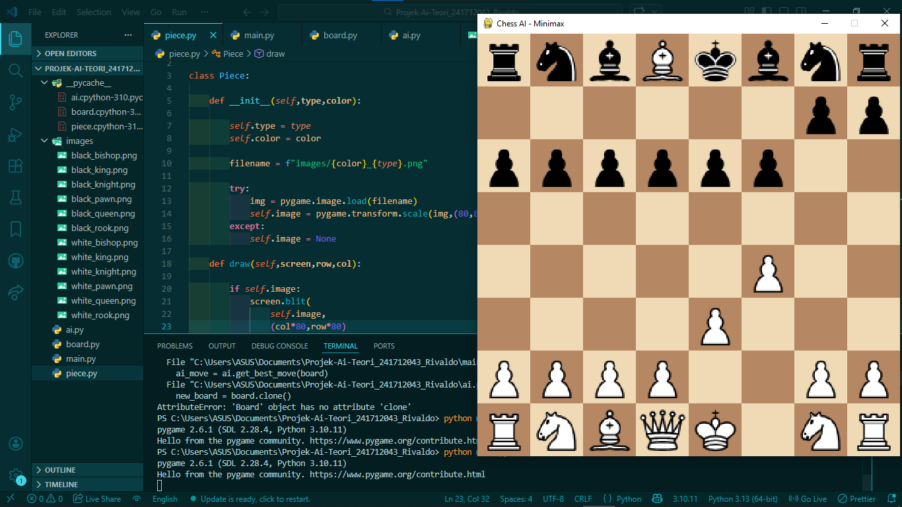

# ♟️ AI Chess Game - Minimax Algorithm

Proyek ini merupakan implementasi sederhana **Artificial Intelligence (AI) pada permainan catur** menggunakan bahasa Python dan algoritma **Minimax dengan Alpha-Beta Pruning**.

Aplikasi ini memungkinkan pemain melawan AI yang dapat menentukan langkah terbaik berdasarkan evaluasi posisi papan.

---

## Demo

<p align="center">
  
</p>

---

## Fitur Utama

* ♟️ Tampilan papan catur menggunakan Pygame
* 🤖 AI menggunakan algoritma Minimax
* ⚡ Optimasi dengan Alpha-Beta Pruning
* 🎮 Interaksi klik untuk menggerakkan bidak
* 🧠 Evaluasi sederhana berdasarkan jumlah bidak

---

## Requirements

Pastikan sudah menginstall Python (disarankan Python 3.8+)

Install library berikut:

```bash
pip install pygame
```

---

## 📁 Struktur Project

```
project-folder/
│
├── main.py          # File utama (game loop)
├── ai.py            # Logika AI (Minimax + Alpha-Beta)
├── board.py         # Representasi papan catur
├── piece.py         # Class bidak catur
├── images/          # Asset gambar bidak
└── hasil_proyek.png # Screenshot hasil
```

---

## Cara Kerja AI

1. AI mengambil semua kemungkinan langkah dari posisi saat ini
2. Setiap langkah disimulasikan menggunakan fungsi `clone()`
3. Algoritma Minimax mengevaluasi posisi hingga depth tertentu
4. Alpha-Beta Pruning digunakan untuk mempercepat pencarian
5. AI memilih langkah dengan skor terbaik

---

## 🎮 Cara Menjalankan

1. Clone repository ini:

```bash
git clone https://github.com/username/ai-game-catur-minimax
```

2. Masuk ke folder project:

```bash
cd ai-game-catur-minimax
```

3. Jalankan program:

```bash
python main.py
```

4. Cara bermain:

* Klik bidak → klik tujuan
* AI akan langsung merespon langkahmu
* Tutup window untuk keluar

---

## ⚠️ Keterbatasan

* Pergerakan masih terbatas (saat ini hanya pawn)
* Tidak ada validasi langkah lengkap (check/checkmate belum ada)
* Evaluasi masih sederhana (berdasarkan jumlah bidak saja)
* Depth minimax masih kecil (agar tidak lag)

---

## Pengembangan Selanjutnya

* Implementasi semua aturan catur lengkap
* Tambahkan GUI yang lebih interaktif
* Gunakan evaluasi posisi yang lebih kompleks
* Tambahkan difficulty level AI

---

## 📚 Teknologi

* Python
* Pygame
* Minimax Algorithm
* Alpha-Beta Pruning

---
